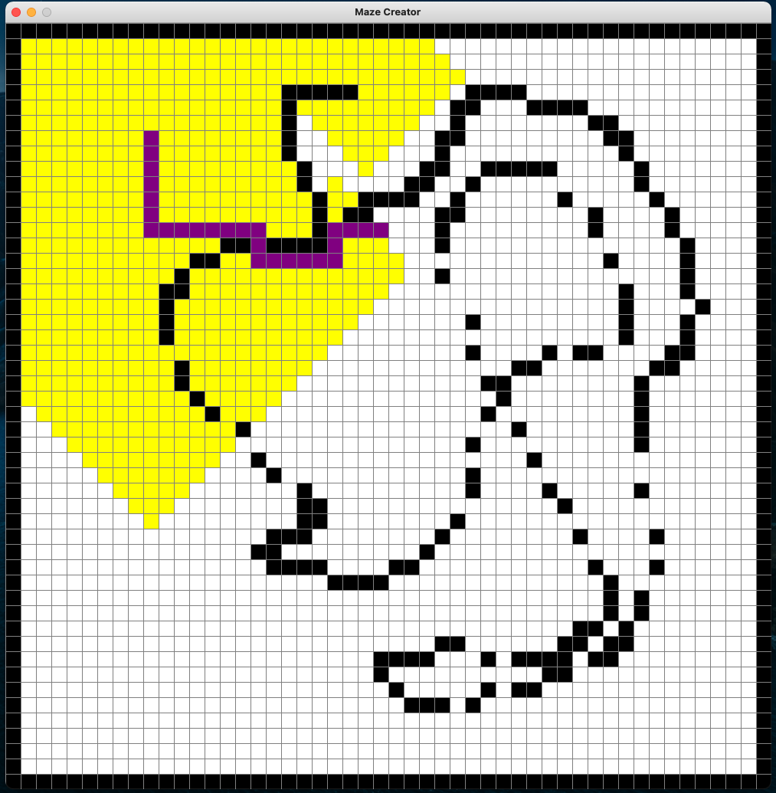
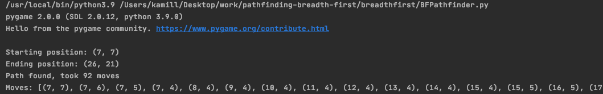

# pathfinding-depth-first
Simple implementation of depth first pathfinding algorithm
# depth first
https://en.wikipedia.org/wiki/Depth-first_search
# running the pathfinder
To run the pathfinder run the breadthfirst/DFPathfinder.py file

- create maze

- press ENTER to export grid
- pathfinding result

- you can also inspect the moves that were made (including starting and ending pos)

# YouTube
https://www.youtube.com/watch?v=QhrNuEBUVIw&feature=youtu.be
# ENJOY